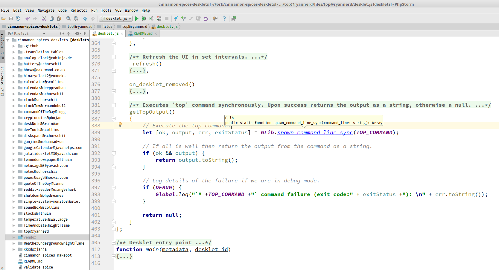

# gnome-autocomplete

Purpose
=======
This project came about with my frustration with the lack of auto complete while I was 
developing [desklets and applets](https://github.com/linuxmint) 
for [Cinnamon](https://cinnamon-spices.linuxmint.com/).
This project will be most useful to those using
 [IDEA based editors](http://www.jetbrains.org/pages/viewpage.action?pageId=983889), but other editors may work as well.

How to use
==========
First clone this repo:

`git clone https://github.com/RyanNerd/gnome-autocomplete.git`

or

`git clone git@github.com:RyanNerd/gnome-autocomplete.git`

As an example let's say you are developing a Desklet and want to use gnome-autocomplete.
In this case you should have a fork of [cinnamon-spices-desklets](https://github.com/linuxmint/cinnamon-spices-desklets) 
on your local machine. Mine is located here:

`~/Fork/cinnamon-spices-desklets`

My gnome-autocomplete fork is here:

`~/Fork/gnome-autocomplete`

In your **cinnamon-spices-desklets directory** run this command:

`ln -s ~/Fork/gnome-autocomplete vendor`

Edit/create your global `.gitignore` at:

`~/.gitignore`

place this line in the `.gitignore` file:

`vendor/`

Your IDE should now exclude the symlinked vendor folder you created from `git` but let you do auto completion:

